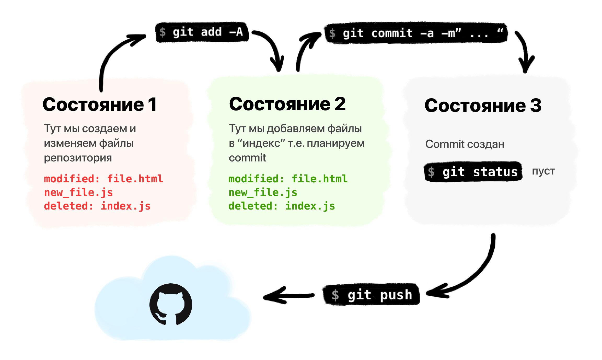
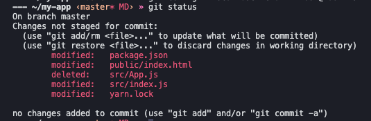
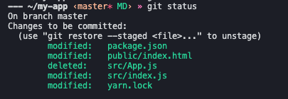
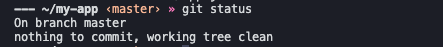
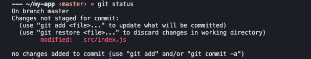

# Git


### Общий принцип работы с Github:


*`git push` здесь сокращена. В первый раз надо писать `$ git push -u origin main`*

**Что означает `-u origin main`:**
- `-u` (или `--set-upstream`) устанавливает upstream связь между локальной веткой `main` и удаленной веткой `origin/main`
- `origin` - это имя удаленного репозитория (по умолчанию GitHub репозиторий называется origin)
- `main` - название ветки
- После установки **upstream** связи можно просто писать `git push` и `git pull` без указания origin и ветки

Команда `git push` здесь сокращена. В первый раз надо писать `$ git push -u origin main`

# Начало работы

В папке с проектом надо проинициализировать Git

```bash
git init
```

После чего в папке с проектом появляется скрытая папка .git

Можно добавить имя и почту (можно локально для проекта, тогда флаг `--local` для глобальных настроек `—-global` )

```bash
git config --global user.name "Vadim Shchekoldin"
git config --global user.email "inbox@vadim.sh"
```

У git репозиторя есть **три условных состояния**:

1. Просто состояние репозитория, есть какие-то изменения с файлами или нет, git все видит что произошло и он нам скажет об этом.
2. Когда git "принял во внимание" что есть определенные файлы которые мы планируем записать в третье состояние. Когда это происходит они попадают в т.н. "индекс".
3. Когда git создал такую "контрольную точку" к которой можно будет вернуться. Она называется **commit**. Это такой аналог бэкапа, операции копирования папки с проектом для новых изменений)

Чтобы понять есть ли контрольные точки (коммиты) и вообще состояние всего, пишем в репозитории:

```bash
git status
```

В самом начале вывод будет таким:


*скриншот*
```bash
--- ~/my-app ‹master* MD› » git status
On branch master
Changes not staged for commit:
	(use "git add/rm <file>..." to update what will be committed)
	(use "git restore <file>..." to discard changes in working directory)
		modified:		package.json
		modified:		public/index.html
		deleted:		src/App.js
		modified:		src/index.js
		modified:		yarn.lock

no changes added to commit (use "git add" and/or "git commit -a")
```

Мы видим что git знает что есть какие-то изменения с файлами и он показывает их красным. Но он просто знает об этом и всё.

Чтобы git "принял во внимание" нужные файлы (в нашем случае мы добавим все) пишем комманду:

```bash
git add -A
```

Если мы проверим `git status` то вывод уже будет таким:


*скриншот*
```bash
--- ~/my-app ‹master* MD› » git status
On branch master
Changes to be committed:
	(use "git restore -staged <file>..." to unstage)
		modified:		package.json
		modified:		public/index.html
		deleted:		src/App.js
		modified:		src/App.js
		modified:		yarn.lock
```

После мы можем перевести состояние в третий режим, то есть делаем коммит (создаем контрольную точку)

```bash
git commit -m"my first commit"
```

Где `-m" ... "` это сообщение где мы подробно указываем информацию о данном коммите, что мы там изменили.

Если мы проверим `git status` то увидим что все чисто, нет ничего:


*скриншот*
```bash
--- ~/my-app ‹master› » git status
On branch master
nothing to commit, working tree clean
```

Далее мы можем изменить какой-нибудь файл, и проверить `git status` что будет:


*скриншот*
```bash
--- ~/my-app ‹master› » git status
On branch master
	Changes not staged for commit:
		(use "git add <file>..." to update what will be committed)
		(use "git restore < file»..." to discard changes in working directory)
			modified:	src/index. js

no changes added to commit (use "git add" and/or "git commit -a")
```


Мы видим что git увидел измененный файл *index.js.* Сейчас мы находимся в первом состоянии.